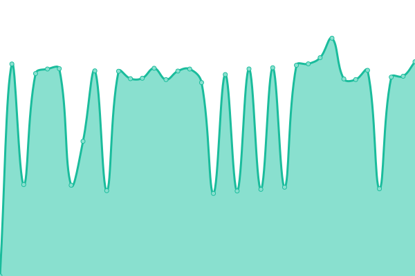

# [📈 Live Status](https://dehunt.github.io/upptime-test): <!--live status--> **🟩 All systems operational**

This repository contains the open-source uptime monitor and status page for [David Hunt](https://dehunt.github.io/upptime-test), powered by [Upptime](https://github.com/upptime/upptime).

With [Upptime](https://upptime.js.org), you can get your own unlimited and free uptime monitor and status page, powered entirely by a GitHub repository. We use [Issues](https://github.com/dehunt/upptime-test/issues) as incident reports, [Actions](https://github.com/dehunt/upptime-test/actions) as uptime monitors, and [Pages](https://dehunt.github.io/upptime-test) for the status page.

<!--start: status pages-->
<!-- This summary is generated by Upptime (https://github.com/upptime/upptime) -->
<!-- Do not edit this manually, your changes will be overwritten -->
<!-- prettier-ignore -->
| URL | Status | History | Response Time | Uptime |
| --- | ------ | ------- | ------------- | ------ |
|  [pdfRest](https://api.pdfrest.com/up) | 🟩 Up | [pdf-rest.yml](https://github.com/dehunt/upptime-test/commits/HEAD/history/pdf-rest.yml) | 

 193ms
     
 | 

<a href="https://dehunt.github.io/upptime-test/history/pdf-rest">100.00%</a>
    

|  [/compressed-pdf](https://status.pdfrest.com/pdfa) | 🟩 Up | [compressed-pdf.yml](https://github.com/dehunt/upptime-test/commits/HEAD/history/compressed-pdf.yml) | 

 5367ms
     
 | 

<a href="https://dehunt.github.io/upptime-test/history/compressed-pdf">100.00%</a>
    

|  [/pdfa](https://status.pdfrest.com/pdfa) | 🟩 Up | [pdfa.yml](https://github.com/dehunt/upptime-test/commits/HEAD/history/pdfa.yml) | 

 4274ms
     
 | 

<a href="https://dehunt.github.io/upptime-test/history/pdfa">99.56%</a>
    

<!--end: status pages-->

[**Visit our status website →**](https://dehunt.github.io/upptime-test)

## 📄 License

- Powered by: [Upptime](https://github.com/upptime/upptime)
- Code: [MIT](./LICENSE) © [David Hunt](https://dehunt.github.io/upptime-test)
- Data in the `./history` directory: [Open Database License](https://opendatacommons.org/licenses/odbl/1-0/)
