# [📈 Live Status](https://dehunt.github.io/upptime-test): <!--live status--> **🟩 All systems operational**

This repository contains the open-source uptime monitor and status page for [David Hunt](https://dehunt.github.io/upptime-test), powered by [Upptime](https://github.com/upptime/upptime).

With [Upptime](https://upptime.js.org), you can get your own unlimited and free uptime monitor and status page, powered entirely by a GitHub repository. We use [Issues](https://github.com/dehunt/upptime-test/issues) as incident reports, [Actions](https://github.com/dehunt/upptime-test/actions) as uptime monitors, and [Pages](https://dehunt.github.io/upptime-test) for the status page.

<!--start: status pages-->
<!-- This summary is generated by Upptime (https://github.com/upptime/upptime) -->
<!-- Do not edit this manually, your changes will be overwritten -->
<!-- prettier-ignore -->
| URL | Status | History | Response Time | Uptime |
| --- | ------ | ------- | ------------- | ------ |
|  [pdfRest](https://status.pdfrest.com/up) | 🟩 Up | [pdf-rest.yml](https://github.com/dehunt/upptime-test/commits/HEAD/history/pdf-rest.yml) | 

 218ms
     
 | 

<a href="https://dehunt.github.io/upptime-test/history/pdf-rest">99.87%</a>
    

|  [/bmp](https://status.pdfrest.com/bmp) | 🟩 Up | [bmp.yml](https://github.com/dehunt/upptime-test/commits/HEAD/history/bmp.yml) | 

 5990ms
     
 | 

<a href="https://dehunt.github.io/upptime-test/history/bmp">100.00%</a>
    

|  [/compressed-pdf](https://status.pdfrest.com/compressed-pdf) | 🟩 Up | [compressed-pdf.yml](https://github.com/dehunt/upptime-test/commits/HEAD/history/compressed-pdf.yml) | 

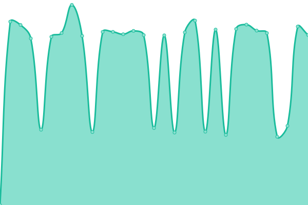 4352ms
     
 | 

<a href="https://dehunt.github.io/upptime-test/history/compressed-pdf">100.00%</a>
    

|  [/decrypted-pdf](https://status.pdfrest.com/decrypted-pdf) | 🟩 Up | [decrypted-pdf.yml](https://github.com/dehunt/upptime-test/commits/HEAD/history/decrypted-pdf.yml) | 

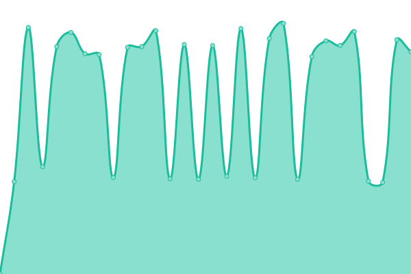 4069ms
     
 | 

<a href="https://dehunt.github.io/upptime-test/history/decrypted-pdf">100.00%</a>
    

|  [/encrypted-pdf](https://status.pdfrest.com/encrypted-pdf) | 🟩 Up | [encrypted-pdf.yml](https://github.com/dehunt/upptime-test/commits/HEAD/history/encrypted-pdf.yml) | 

 3908ms
     
 | 

<a href="https://dehunt.github.io/upptime-test/history/encrypted-pdf">100.00%</a>
    

|  [/flattened-annotations-pdf](https://status.pdfrest.com/flattened-annotations-pdf) | 🟩 Up | [flattened-annotations-pdf.yml](https://github.com/dehunt/upptime-test/commits/HEAD/history/flattened-annotations-pdf.yml) | 

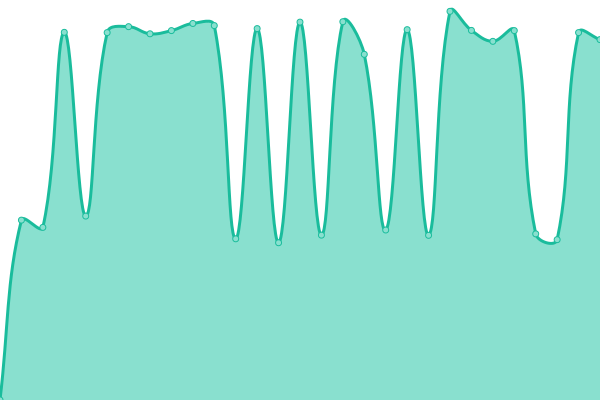 4467ms
     
 | 

<a href="https://dehunt.github.io/upptime-test/history/flattened-annotations-pdf">100.00%</a>
    

|  [/flattened-layers-pdf](https://status.pdfrest.com/flattened-layers-pdf) | 🟩 Up | [flattened-layers-pdf.yml](https://github.com/dehunt/upptime-test/commits/HEAD/history/flattened-layers-pdf.yml) | 

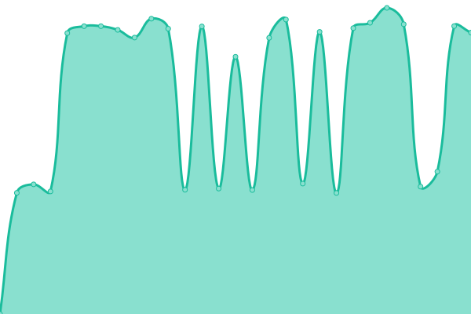 4352ms
     
 | 

<a href="https://dehunt.github.io/upptime-test/history/flattened-layers-pdf">100.00%</a>
    

|  [/flattened-transparencies-pdf](https://status.pdfrest.com/flattened-transparencies-pdf) | 🟩 Up | [flattened-transparencies-pdf.yml](https://github.com/dehunt/upptime-test/commits/HEAD/history/flattened-transparencies-pdf.yml) | 

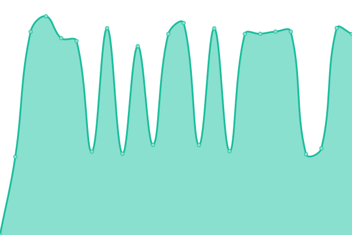 4116ms
     
 | 

<a href="https://dehunt.github.io/upptime-test/history/flattened-transparencies-pdf">100.00%</a>
    

|  [/gif](https://status.pdfrest.com/gif) | 🟩 Up | [gif.yml](https://github.com/dehunt/upptime-test/commits/HEAD/history/gif.yml) | 

 4987ms
     
 | 

<a href="https://dehunt.github.io/upptime-test/history/gif">100.00%</a>
    

|  [/jpg](https://status.pdfrest.com/jpg) | 🟩 Up | [jpg.yml](https://github.com/dehunt/upptime-test/commits/HEAD/history/jpg.yml) | 

 4851ms
     
 | 

<a href="https://dehunt.github.io/upptime-test/history/jpg">100.00%</a>
    

|  [/linearized-pdf](https://status.pdfrest.com/linearized-pdf) | 🟩 Up | [linearized-pdf.yml](https://github.com/dehunt/upptime-test/commits/HEAD/history/linearized-pdf.yml) | 

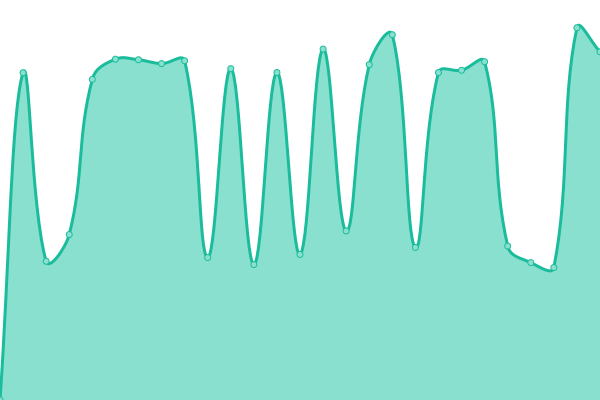 3946ms
     
 | 

<a href="https://dehunt.github.io/upptime-test/history/linearized-pdf">100.00%</a>
    

|  [/merged-pdf](https://status.pdfrest.com/merged-pdf) | 🟩 Up | [merged-pdf.yml](https://github.com/dehunt/upptime-test/commits/HEAD/history/merged-pdf.yml) | 

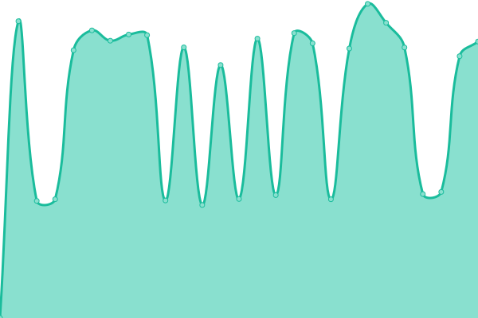 4232ms
     
 | 

<a href="https://dehunt.github.io/upptime-test/history/merged-pdf">100.00%</a>
    

|  [/pdf](https://status.pdfrest.com/pdf) | 🟩 Up | [pdf.yml](https://github.com/dehunt/upptime-test/commits/HEAD/history/pdf.yml) | 

 4526ms
     
 | 

<a href="https://dehunt.github.io/upptime-test/history/pdf">100.00%</a>
    

|  [/pdf-info](https://status.pdfrest.com/pdf-info) | 🟩 Up | [pdf-info.yml](https://github.com/dehunt/upptime-test/commits/HEAD/history/pdf-info.yml) | 

 4076ms
     
 | 

<a href="https://dehunt.github.io/upptime-test/history/pdf-info">100.00%</a>
    

|  [/pdf-with-added-image](https://status.pdfrest.com/pdf-with-added-image) | 🟩 Up | [pdf-with-added-image.yml](https://github.com/dehunt/upptime-test/commits/HEAD/history/pdf-with-added-image.yml) | 

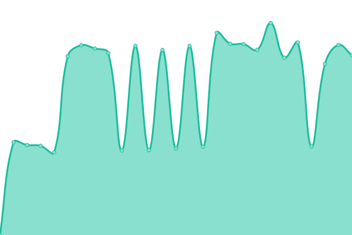 4453ms
     
 | 

<a href="https://dehunt.github.io/upptime-test/history/pdf-with-added-image">100.00%</a>
    

|  [/pdfa](https://status.pdfrest.com/pdfa) | 🟩 Up | [pdfa.yml](https://github.com/dehunt/upptime-test/commits/HEAD/history/pdfa.yml) | 

 4415ms
     
 | 

<a href="https://dehunt.github.io/upptime-test/history/pdfa">99.74%</a>
    

|  [/pdfx](https://status.pdfrest.com/pdfx) | 🟩 Up | [pdfx.yml](https://github.com/dehunt/upptime-test/commits/HEAD/history/pdfx.yml) | 

 4140ms
     
 | 

<a href="https://dehunt.github.io/upptime-test/history/pdfx">100.00%</a>
    

|  [/png](https://status.pdfrest.com/png) | 🟩 Up | [png.yml](https://github.com/dehunt/upptime-test/commits/HEAD/history/png.yml) | 

 5652ms
     
 | 

<a href="https://dehunt.github.io/upptime-test/history/png">100.00%</a>
    

|  [/restricted-pdf](https://status.pdfrest.com/restricted-pdf) | 🟩 Up | [restricted-pdf.yml](https://github.com/dehunt/upptime-test/commits/HEAD/history/restricted-pdf.yml) | 

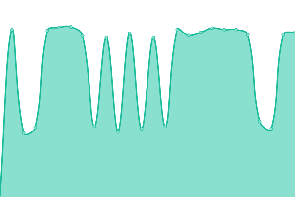 4097ms
     
 | 

<a href="https://dehunt.github.io/upptime-test/history/restricted-pdf">100.00%</a>
    

|  [/split-pdf](https://status.pdfrest.com/split-pdf) | 🟩 Up | [split-pdf.yml](https://github.com/dehunt/upptime-test/commits/HEAD/history/split-pdf.yml) | 

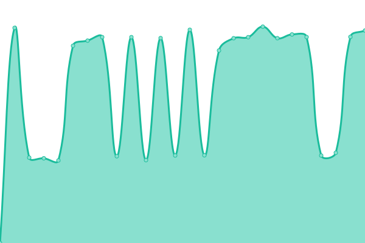 4005ms
     
 | 

<a href="https://dehunt.github.io/upptime-test/history/split-pdf">100.00%</a>
    

|  [/tif](https://status.pdfrest.com/tif) | 🟩 Up | [tif.yml](https://github.com/dehunt/upptime-test/commits/HEAD/history/tif.yml) | 

 4776ms
     
 | 

<a href="https://dehunt.github.io/upptime-test/history/tif">100.00%</a>
    

|  [/unrestricted-pdf](https://status.pdfrest.com/unrestricted-pdf) | 🟩 Up | [unrestricted-pdf.yml](https://github.com/dehunt/upptime-test/commits/HEAD/history/unrestricted-pdf.yml) | 

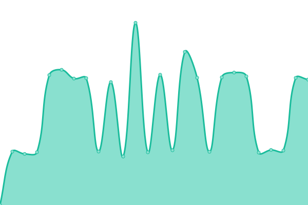 3814ms
     
 | 

<a href="https://dehunt.github.io/upptime-test/history/unrestricted-pdf">100.00%</a>
    

|  [/upload](https://status.pdfrest.com/upload) | 🟩 Up | [upload.yml](https://github.com/dehunt/upptime-test/commits/HEAD/history/upload.yml) | 

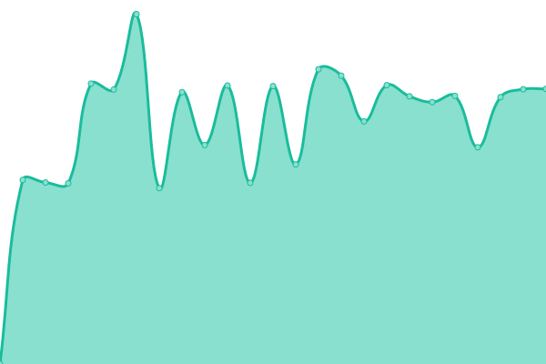 2369ms
     
 | 

<a href="https://dehunt.github.io/upptime-test/history/upload">100.00%</a>
    

|  [/watermarked-pdf](https://status.pdfrest.com/watermarked-pdf) | 🟩 Up | [watermarked-pdf.yml](https://github.com/dehunt/upptime-test/commits/HEAD/history/watermarked-pdf.yml) | 

 4423ms
     
 | 

<a href="https://dehunt.github.io/upptime-test/history/watermarked-pdf">100.00%</a>
    

|  [/zip](https://status.pdfrest.com/zip) | 🟩 Up | [zip.yml](https://github.com/dehunt/upptime-test/commits/HEAD/history/zip.yml) | 

 3965ms
     
 | 

<a href="https://dehunt.github.io/upptime-test/history/zip">100.00%</a>
    

<!--end: status pages-->

[**Visit our status website →**](https://dehunt.github.io/upptime-test)

## 📄 License

- Powered by: [Upptime](https://github.com/upptime/upptime)
- Code: [MIT](./LICENSE) © [David Hunt](https://dehunt.github.io/upptime-test)
- Data in the `./history` directory: [Open Database License](https://opendatacommons.org/licenses/odbl/1-0/)
